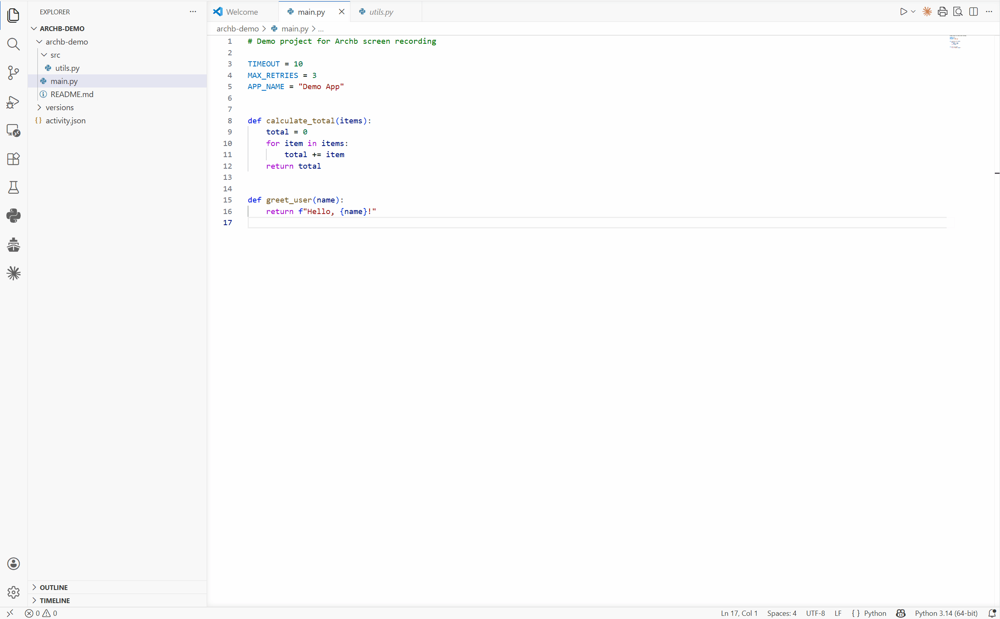

# Archb

**Archb automatically documents why you changed your code**

While you code, Archb watches your files. When you are ready, it asks you one targeted question per logical change group. Your answers are transformed into professional changelogs for your development team and customers, release notes, and Q&A logs. All powered by ChatGPT, Claude, or a local Ollama model.



## Coming soon: Archb Pro

The current version of Archb works with your own ChatGPT or Claude API key, or with a local Ollama model.

Archb Pro is coming soon and will include access to a dedicated AI model trained specifically for code documentation. It is fine-tuned on thousands of real code changes and produces higher quality questions and changelogs than general-purpose models.

No Ollama setup. No API key from a third party. Just plug in your Archb Pro key and go.

If you want early access, open an issue on [GitHub](https://github.com/TB2724/archb) with the title "Pro access request".


## How it works

1. **Activate Archb** in the sidebar and it starts watching your files silently
2. **Code as usual** and Archb detects and groups your changes in the background, follow the logs live in the sidebar
3. **Click "Save Session & Ask"** and Archb asks you one short question per logical change group
4. **Answer the questions** which takes 10 to 30 seconds for a typical session
5. **Your logs are ready** as Q&A log, Technical Changelog, and Customer Release Notes


## Features

### AI-powered questions
Archb clusters your code changes by type (new function, value change, logic change, comment, layout) and asks a single targeted question per group. No noise, no repetition.

### Three log types generated automatically

- **Q&A Log:** raw question and answer pairs, saved live after every answer

- **Technical Changelog:** professional developer-facing changelog grouped by file, with change type and timestamp per entry

- **Customer Release Notes:** plain-language release notes with no technical jargon, ready to share with non-technical stakeholders

### Supports ChatGPT, Claude, and Ollama

**ChatGPT** → enter your OpenAI API key in AI Settings

**Claude** → enter your Anthropic API key in AI Settings

**Ollama** → runs fully locally, no API key needed (requires Ollama installed)

Claude takes priority over ChatGPT if both are set. If neither is set, Archb falls back to Ollama automatically.

### GitHub Push with AI commit message
The GitHub Push button runs your Q&A session, then commits and pushes your changes with an AI-generated commit message that reflects what you actually changed and why.

### Project snapshots
Every session creates a full snapshot ZIP of your project (excluding node_modules, .venv, build folders, and other large directories) so you always have a point-in-time backup.

### Privacy-first option
Run Archb with a local Ollama model and your code never leaves your machine.


## Requirements

### Minimum
- VS Code 1.85 or later
- One of the following:
  - OpenAI API key (ChatGPT)
  - Anthropic API key (Claude)
  - Ollama installed locally

### Optional
- Git and GitHub CLI (for the GitHub Push feature)


## Installation

### 1. Install the extension
Search for **Archb** in the VS Code Extensions Marketplace (Ctrl+Shift+X) and click Install.

### 2. Set up your AI

Open the Archb sidebar (click the ship icon in the Activity Bar), then open **AI Settings**.

**Option A: ChatGPT**
1. Go to [platform.openai.com/api-keys](https://platform.openai.com/api-keys)
2. Create a new API key
3. Paste it into the **ChatGPT** field in AI Settings
4. Click **Save AI Settings**

**Option B: Claude**
1. Go to [console.anthropic.com](https://console.anthropic.com)
2. Create a new API key
3. Paste it into the **Claude** field in AI Settings
4. Click **Save AI Settings**

**Option C: Ollama (local, free)**
1. Install Ollama from [ollama.com](https://ollama.com)
2. Pull a model:
   ```
   ollama pull qwen2.5-coder:7b
   ```
3. Leave AI Settings empty and Archb detects Ollama automatically


## Usage

### Starting a session
1. Open a workspace folder in VS Code
2. Click **Activate** in the Archb sidebar
3. Code as usual and Archb watches your files automatically
4. When you are ready, click **Save Session & Ask**
5. A popup appears with one question per logical change group
6. Answer each question and press **Enter** (or click Submit)
7. Your logs are saved automatically in `versions/v1.X/logs/`

### Reviewing and revising answers
Click any answered entry (marked with a checkmark) in the sidebar log to reopen it and revise your answer.

### Generating changelogs
Technical and Customer logs are generated automatically when you click manually **Deactivate** Archb. If you activate it again, a new version folder appears and the logs start from zero. They appear in `versions/v1.X/logs/` as:

```
v1.X_technical.md
v1.X_customer.md
```

### GitHub Push

**Step 1: Install Git**

Download and install Git from [git-scm.com](https://git-scm.com). During installation, keep the default options.

**Step 2: Install GitHub CLI**

Open PowerShell and run:
```powershell
winget install GitHub.cli
```

If `winget` is not available, download the installer directly from [cli.github.com](https://cli.github.com), run it, then open a new PowerShell window in VS Code, best in your project folder.

**Step 3: Authenticate with GitHub**

```powershell
gh auth login
```

Follow the prompts:
- Where do you use GitHub? → `GitHub.com`
- What is your preferred protocol? → `HTTPS`
- Authenticate Git with your GitHub credentials? → `Yes`
- How would you like to authenticate? → `Login with a web browser`

A browser window opens. Click **Authorize GitHub CLI** and you are done.

**Step 4: Create a GitHub repository**

Go to [github.com](https://github.com/new), create a new repository, and copy the HTTPS URL (for example `https://github.com/yourname/yourrepo.git`).

**Step 5: Initialize Git in your project (if not done yet)**

Open a terminal in your project folder and run:
```powershell
git init
git add .
git commit -m "Initial commit"
git branch -M main
git remote add origin https://github.com/yourname/yourrepo.git
git push -u origin main
```

**Step 6: Fill in Git Settings in Archb**

Open the Archb sidebar, then open **Git Settings**:
- `user.name` → your name
- `user.email` → your GitHub email
- `remote url` → the HTTPS URL of your repository
- `default branch` → `main`

Click **Save Git Settings**.

**Step 7: Use the GitHub Push button**

Click **GitHub Push** in the Archb sidebar. Archb will run the Q&A session, generate a commit message, and push your changes automatically.


## Where logs are saved

All logs are saved inside your workspace folder:

```
your-project/
└── versions/
    └── v1.1/
        ├── meta.json
        ├── snapshot/
        │   └── snapshot.zip
        └── logs/
            ├── v1.1_qna_live.md       (Q&A pairs, saved live)
            ├── v1.1_raw_live.md       (Raw diffs, updated in real-time)
            ├── v1.1_technical.md      (Technical changelog, on deactivate)
            └── v1.1_customer.md       (Customer release notes, on deactivate)
```

Each Activate/Deactivate cycle creates a new version (v1.2, v1.3, etc.).


## AI Settings

Open the Archb sidebar and then open **AI Settings**.

| Field | Description |
|-------|-------------|
| ChatGPT | Your OpenAI API key (starts with `sk-`) |
| Claude | Your Anthropic API key (starts with `sk-ant-`) |

Leave both empty to use Ollama. Claude takes priority if both are set. Tokens are validated on save and you get a clear error message if the format is wrong.


## Git Settings

Open the Archb sidebar and then open **Git Settings**.

| Field | Description |
|-------|-------------|
| user.name | Your Git display name |
| user.email | Your Git email |
| remote url | Your GitHub repository URL |
| default branch | Usually `main` |

Required only for the GitHub Push feature


## Known limitations

- Snapshot runs asynchronously and may take 10 to 30 seconds for large projects. You can keep coding while it runs.
- Technical and Customer logs are generated at Deactivate, not during the session.
- GitHub Push requires Git and GitHub CLI. See setup instructions above.
- Multi-root workspaces: only the first folder is tracked.
- Ollama must be running. Start it with `ollama serve` before activating Archb.


## Troubleshooting

**Archb is not asking any questions**
Make sure you clicked Activate first. The file watcher only runs when Archb is active (shown by the green dot in the sidebar).

**No API key set but Ollama is not installed**
Either install Ollama from [ollama.com](https://ollama.com) or add a ChatGPT or Claude API key in AI Settings.

**GitHub Push fails with 403**
Run `gh auth login` in your terminal and follow the browser authentication flow.

**GitHub Push fails with "rejected (fetch first)"**
Archb automatically runs `git pull --rebase` before pushing. If you still see this error, run the following manually:
```
git pull --rebase origin main
git push origin main
```

**Technical and Customer logs are empty**
You need at least one answered Q&A entry. Answer the questions in Save Session & Ask, then click Deactivate to generate the logs.


## License

MIT. See [LICENSE](LICENSE) for details.


## Feedback

Found a bug or have a feature request? Open an issue on [GitHub](https://github.com/TB2724/archb).

## Privacy note: When using ChatGPT or Claude, 
code diffs and your answers are sent to the 
respective API provider (OpenAI or Anthropic). 
When using Ollama, everything stays local.